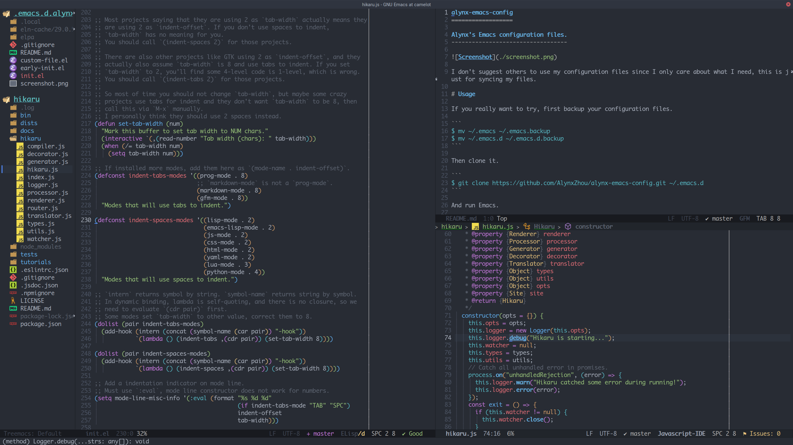

alynx-emacs-config
==================

Alynx's Emacs configuration files.
----------------------------------



This repo is very personalized and may not be suitable for everyone, I use it for syncing files between my systems primarily.

# Usage

Just in case I forget how to use it, and if you really want to try, first backup your configuration files.

```shell
$ mv ~/.emacs ~/.emacs.backup
$ mv ~/.emacs.d ~/.emacs.d.backup
```

Then clone it.

```shell
$ git clone https://github.com/AlynxZhou/alynx-emacs-config.git ~/.emacs.d && cd $_
$ git submodule init && git submodule update --recursive
```

To use tree-sitter, tree-sitter language modules are needed, manually building them from <https://github.com/casouri/tree-sitter-module/> is recommended:

```shell
$ git clone https://github.com/casouri/tree-sitter-module.git && cd tree-sitter-module/
$ ./batch.sh
$ mkdir -p ~/.emacs.d/.local/treesit/ && cp dist/* $_
```

Install dependencies and language servers for `lsp-bridge` (`clangd` is included by `clang` package):

```shell
# pacman -S python-orjson python-six python-paramiko python-rapidfuzz python-watchdog clang typescript-language-server bash-language-server yaml-language-server pyright vscode-html-languageserver
$ paru -S python-epc python-sexpdata
```

For macOS, check [lsp-bridge's doc](https://github.com/manateelazycat/lsp-bridge?tab=readme-ov-file#installation) for installing dependencies with `pip`.

Because [`flycheck` currently cannot run locally installed `standardx`](https://github.com/flycheck/flycheck/issues/1428), you may need to install `standardx` globally:

```shell
$ npm install --global standardx
```

And run Emacs.

I am using Emacs master branch with pgtk, native-comp and tree-sitter, if you are not using the latest version, it may not work. You may read my [PKGBUILD](https://github.com/AlynxZhou/alynx-arch-packages/blob/master/packages/emacs-alynx/PKGBUILD) for my Emacs building options, but it may be not OK for you.

To flush all installed packages and re-installed them, run the following command:

```shell
$ rm -rf ~/.emacs.d/{elpa,eln-cache} && rm ~/.emacs.d/.local/cache/package-quickstart.el*
```

# Dir Structure

- `site-lisp`: Third party packages that installed as git submodule instead of from MELPA.
- `lisp`: Standalone packages that can be used without this project.
- `snippets`: Code snippets.
- `.local`: Files that won't sync, like backup and cache files.

If there are more dirs to sync, put them into project root, and if configurations are splitted into different files, just put them into project root (not in `lisp`), too.

# Build Emacs

This configuration requires latest Emacs master, so building Emacs manually is required, here are compiling options I used to build my Emacs on different systems.

## Arch Linux

My own PKGBUILD can be found in my Arch Linux packages repo: <https://github.com/AlynxZhou/alynx-arch-packages/tree/master/packages/emacs-alynx/>. Just run `makepkg -sif` should be enough to build an `emacs-alynx` package.

## macOS

I install following dependencies with Homebrew (incomplete, I'll add more if I find something missing):

```shell
$ brew install autoconf automake gcc pkg-config libtool libgccjit tree-sitter gmp gnutls texinfo mailutils sqlite3
```

If there is no `configure` script, run following command to generate it:

```shell
$ ./autogen.sh git && ./autogen.sh autoconf
```

Run `configure` with following options:

```shell
$ CFLAGS="-march=native -O2 -I/opt/homebrew/include -L/opt/homebrew/lib" ./configure \
	--with-ns \
	--without-x \
	--without-xwidgets \
	--without-xaw3d \
	--without-dbus \
	--without-gconf \
	--without-gsettings \
	--without-libotf \
	--without-m17n-flt \
	--without-compress-install \
	--with-native-compilation=aot \
	--with-tree-sitter \
	--with-sqlite3 \
	--with-libgmp \
	--with-gnutls \
	--with-xml2 \
	--with-webp \
	--with-mailutils
```

Because Homebrew installs packages to `/opt/homebrew` on Apple Silicon machines, `CFLAGS` is needed to find headers and libraries. You may or may not add `CC="gcc-15"` to use the real GCC installed by Homebrew (Homebrew always install GCC binary with suffix, so you need to change this when GCC release new version), because using Clang is OK for building Emacs.

And then compile all sources, and create a `Emacs.app` under `nextstep` dir so we can install it:

```shell
$ make -j 8
$ make install
```

You may need to replace `make` with `make bootstrap` sometimes.

Then you can create a `emacs` script with following content to run Emacs from shell:

```bash
#!/bin/bash

/Applications/Emacs.app/Contents/MacOS/Emacs "${@}"
```

And you can create a `emacsclient` script with following content to run Emacs client from shell:

```bash
#!/bin/bash

/Applications/Emacs.app/Contents/MacOS/bin/emacsclient "${@}"
```

Or set following `PATH` to run `Emacs` and `emacsclient` binary:

```bash
# The actual binary is called `Emacs`, but macOS is not case sensitive.
export PATH="/Applications/Emacs.app/Contents/MacOS:/Applications/Emacs.app/Contents/MacOS/bin:${PATH}"
```

Native compilation may fail on macOS with `ld: library not found for emutls_w`, that is because the default `gcc` binary on macOS is Clang which is different from GCC for some behavior and libraries. The easiest way to fix that is run Emacs in shell with `CC="gcc-15"` environment variable to let it find the real GCC, you don't need to do this every time because native compilation only happens when the compiled cache is outdated or cleared.

# Note

## Indentation Handling

There are two helper functions to choose using tabs or spaces and set `indent-offset`. If you want to use tabs, press `C-c i TAB` or `M-x indent-tabs`, and it will ask you for `indent-offset`'s value. If you want to use spaces, press `C-c i SPC` or `M-x indent-spaces`, and it will ask you for `indent-offset`'s value.

You may find that many articles tell you to modify `tab-width`, but this is not correct. You may use other editors that use `tab-width` as `indent-offset`, but this is not correct, either. To be clear, "using tab to indent" does not mean never using spaces, it means "if total indent levels is larger than `tab-width`, put tabs here and use spaces for trailing length that smaller than `tab-width`".

For example, projects like GTK use 2 as `indent-offset` and 8 as `tab-width`, and they do use tab, if you have a code block that has 5 indent levels, it's actually using 1 tab and 2 spaces. And if you are using editors that mix `indent-offset` and `tab-width`, and you set `tab-width` to 2, you will find that this code block is wrongly placed in 2 indent levels. You should use `M-x indent-tabs RET 2 RET` for those projects.

If you really want to modify `tab-width`, you can press `C-c i w` or `M-x set-tab-width`, but I suggest that if you want to set `tab-width` to value other than 8, you should just use spaces to indent, which means you'll never have tabs in your files, because most projects assume `tab-width` is 8 and just use spaces if they think 8 is too long.

There is an indicator on mode line, first is `TAB` or `SPC`, second is `indent-offset`, third is `tab-width`.
