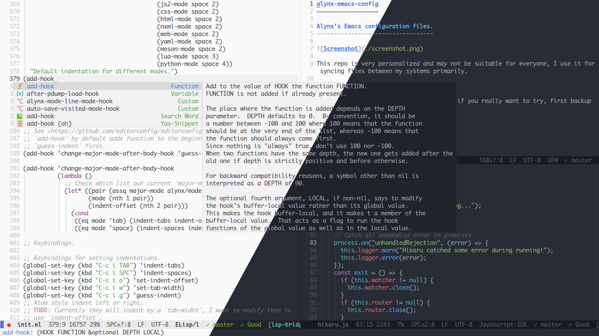

alynx-emacs-config
==================

Alynx's Emacs configuration files.
----------------------------------



This repo is very personalized and may not be suitable for everyone, I use it for syncing files between my systems primarily.

# Usage

Just in case I forget how to use it, and if you really want to try, first backup your configuration files.

```shell
$ mv ~/.emacs ~/.emacs.backup
$ mv ~/.emacs.d ~/.emacs.d.backup
```

Then clone it.

```shell
$ git clone https://github.com/AlynxZhou/alynx-emacs-config.git ~/.emacs.d && cd $_
$ git submodule init && git submodule update --recursive
```

Install dependencies and language servers for `lsp-bridge` (`clangd` is included by `clang` package):

```shell
# pacman -S python-orjson python-six clang typescript-language-server bash-language-server pyright
$ paru -S python-epc python-sexpdata
```

And run Emacs.

I am using Emacs master branch with pgtk and native-comp, if you are not using the latest version, it may not work. You may read my [PKGBUILD](./dists/arch/PKGBUILD) for my Emacs building options, but it may be not OK for you.

To flush all installed packages and re-installed them, run the following command:

```shell
$ rm -rf ~/.emacs.d/{elpa,eln-cache} && rm ~/.emacs.d/.local/cache/package-quickstart.el*
```

# Dir Structure

- `site-lisp`: Third party packages that installed as git submodule instead of from MELPA.
- `lisp`: Standalone packages that can be used without this project.
- `snippets`: Code snippets.
- `.local`: Files that won't sync, like backup and cache files.

If there are more dirs to sync, put them into project root, and if configurations are splitted into different files, just put them into project root (not in `lisp`), too.

# Notice

## Indentation Handling

By default, Emacs has different indent variables for different modes, and you need to set different one if you don't use mode's default value. To simplify this, I create a single variable and make aliases between modes' indent variables and this one. And I create some helper functions to set this.

There is a buffer-local variable called `indent-offset`, if you want to change a file's indent offset (which means a indent level in this file is how many chars), just edit this variable. Currently I only make aliases for modes I use, if you install more modes, append their indent variables to `mode-indent-offsets` list.

There are two helper functions to choose using tabs or spaces and set `indent-offset`. If you want to use tabs, press `C-c i TAB` or `M-x indent-tabs`, and it will ask you for `indent-offset`'s value. If you want to use spaces, press `C-c i SPC` or `M-x indent-spaces`, and it will ask you for `indent-offset`'s value.

You may find that many articles tell you to modify `tab-width`, but this is not correct. You may use other editors that use `tab-width` as `indent-offset`, but this is not correct, either. To be clear, "using tab to indent" does not mean never using spaces, it means "if total indent levels is larger than `tab-width`, put tabs here and use spaces for trailing length that smaller than `tab-width`".

For example, projects like GTK use 2 as `indent-offset` and 8 as `tab-width`, and they do use tab, if you have a code block that has 5 indent levels, it's actually using 1 tab and 2 spaces. And if you are using editors that mix `indent-offset` and `tab-width`, and you set `tab-width` to 2, you will find that this code block is wrongly placed in 2 indent levels. You should use `M-x indent-tabs RET 2 RET` for those projects.

If you really want to modify `tab-width`, you can press `C-c i w` or `M-x set-tab-width`, but I suggest that if you want to set `tab-width` to value other than 8, you should just use spaces to indent, which means you'll never have tabs in your files, because most projects assume `tab-width` is 8 and just use spaces if they think 8 is too long.

There are two cons lists called `indent-tabs-modes` and `indent-spaces-modes` that holds default value of `indent-offset` for different modes. The car of cons is mode's hook without hook, and the cdr of cons is default value of `indent-offset`, you should modify those lists if you want different settings.

There is an indicator on mode line, first is `TAB` or `SPC`, second is `indent-offset`, third is `tab-width`.
